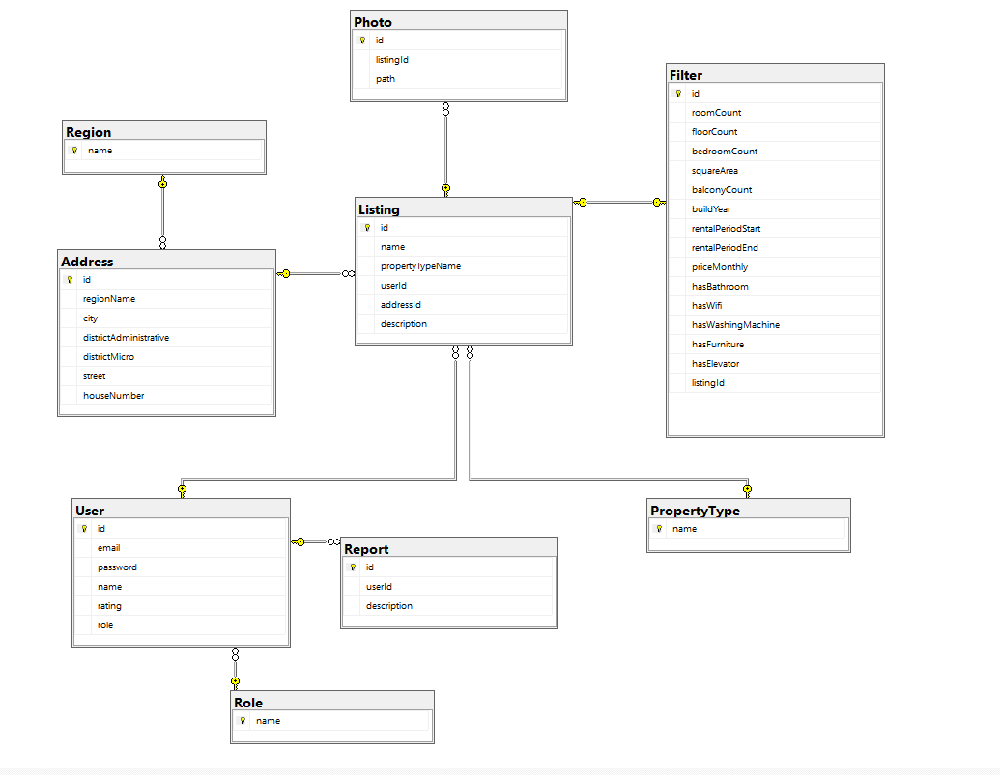

# 2a_BielRent
 Описание проекта.
	Проект “BielRent” представляет собой веб-сервис для аренды недвижимости и размещения объявлений о сдаче в аренду. 
  Сервис предназначен для людей, ищущих услуги долгосрочной аренды. Веб-сайт имеет удобный и интуитивный пользовательский интерфейс. 
  Размещение новых объявлений о сдаче недвижимости в аренду не занимает много времени.

  Используемые технологии:
Bootstrap - библиотека CSS и JS классов для упрощения фронтенд разработки.
Thymeleaf - библиотека для шаблонизирования .html страниц.
JAX-RS - библиотека для реализации REST API методов.
Swagger - документацирование REST API
Сервлеты - технология используемая для реализации клиент-серверного приложения.
Tomcat - веб-сервер, контейнер сервлетов.
JUnit5 - библиотека для unit-тестирования.
log4j2 - библиотека для логгирования.
Maven - инструмент для автоматизации сборки проектов и управления зависимостями.
JDBC - API для взаимодействия с БД.
Microsoft SQL Server - СУБД.

ER Diagram:
  
